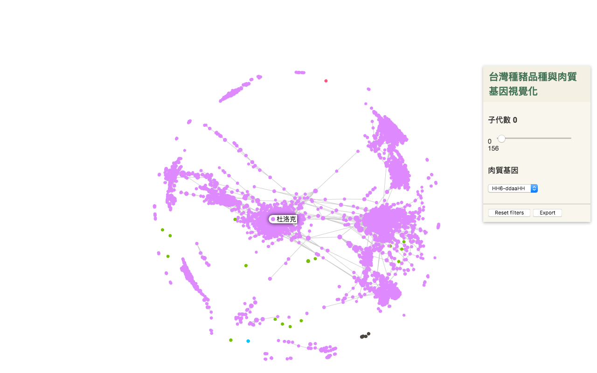

# 台灣種豬品種與肉質基因視覺化

將台灣畜產種原資訊網中的[種豬資料庫](http://pigbase.angrin.tlri.gov.tw/pigfarm/rpr.asp)裡的資料依品種、肉質基因做視覺化呈現。

每個點代表一隻種豬，線條代表他們是親子關係（可能是父子或母子），顏色代表豬的品種。同一團的點之間的線比較緊密，代表他們是同一個家族。將滑鼠移到點上，即可查看種豬的品種名。

右邊選單可以選取「肉質基因」，裡面有多種基因的組合。

選取了HH6-ddaaHH基因型之後，可以看出杜洛克品種的豬帶有較多此基因，也可以看出杜洛克品種中哪個家族帶有較多此基因。

